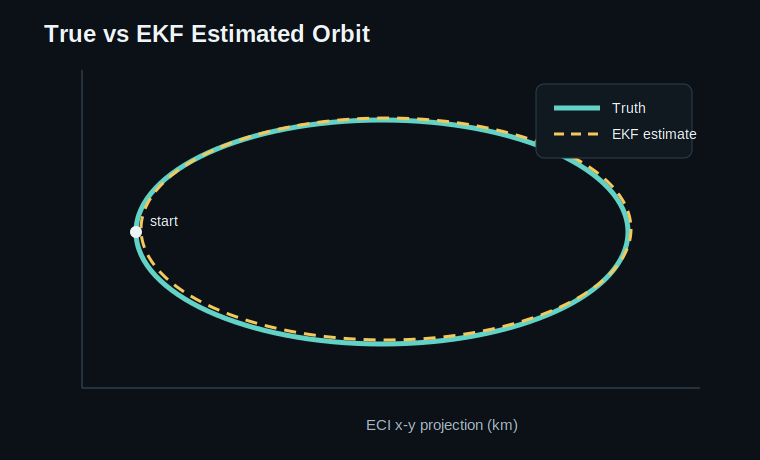
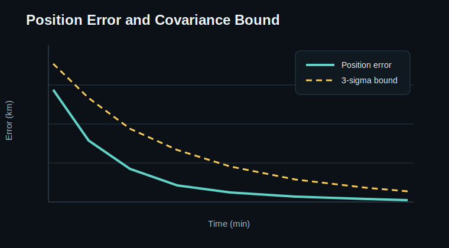
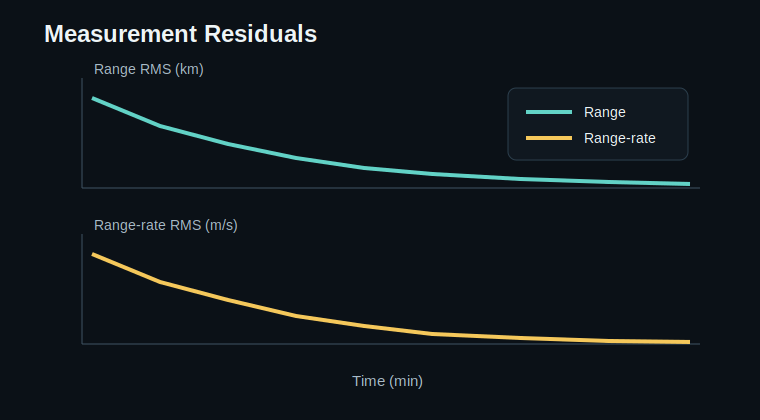

# Extended Kalman Filter Orbit Determination for SSA Tracklet Processing

This repository demonstrates a compact Extended Kalman Filter (EKF) workflow for
orbit determination from noisy ground-based observations. It is framed as a
space-situational-awareness (SSA) prototype: start from a perturbed Cartesian
state, ingest sequential range/range-rate measurements, propagate state and
covariance, and show how the estimate converges toward the truth trajectory.

## Why This Matters

Orbit-determination support roles often require more than propagating a TLE. A
solutions engineer needs to explain what observations were used, how uncertainty
was represented, how residuals behaved, and whether the estimated state is
credible enough for downstream screening or conjunction analysis. This project
keeps those pieces visible.

## Scenario

- **Object:** representative LEO spacecraft
- **State vector:** `[rx, ry, rz, vx, vy, vz]` in ECI km and km/s
- **Dynamics:** two-body Earth gravity with a fixed-step RK4 propagator
- **Measurements:** simulated range/range-rate from three ground stations
- **Filter:** discrete EKF with numerical state-transition and measurement
  Jacobians
- **Outputs:** state estimate history, residuals, covariance history, and plots

## Repository Layout

```text
.
|-- examples/
|   `-- run_demo.py              # Reproducible EKF demo
|-- src/
|   `-- ekf_od/
|       |-- dynamics.py          # Two-body propagation helpers
|       |-- filter.py            # EKF predict/update implementation
|       |-- measurements.py      # Range/range-rate model
|       |-- plotting.py          # Diagnostic plot generation
|       `-- simulation.py        # Truth and observation simulation
|-- docs/
|   `-- plots/                   # Example reviewer-facing outputs
`-- pyproject.toml
```

## Quick Start

```bash
python -m pip install -e .
python examples/run_demo.py
```

The demo writes plots to `docs/plots/`.

## Example Outputs

### Orbit Estimate



### Position Error



### Measurement Residuals



## Current Demo Result

The included example starts with a deliberately perturbed initial state and
assimilates noisy range/range-rate observations over one LEO arc.

| Metric | Demo Value |
| --- | ---: |
| First posterior position error | ~0.03 km |
| Final position error | ~0.02 km |
| First posterior velocity error | ~0.00013 km/s |
| Final velocity error | ~0.00002 km/s |
| Measurements processed | 90 |

Exact values may vary slightly if the random seed or noise assumptions are
changed.

## SSA Interpretation

This is not a production-grade orbit-determination system. It is a transparent
prototype showing the core mechanics that matter for SSA analysis:

- sequential observation processing;
- covariance propagation and update;
- residual inspection;
- state-estimation convergence;
- reviewer-facing plots and reproducible artifacts.

## Next Extensions

- Add J2 and drag perturbations.
- Support angles-only optical observations.
- Add finite-difference Jacobian tests.
- Compare EKF results against batch least-squares orbit determination.
- Export estimated ephemerides and covariance histories as CSV files.
